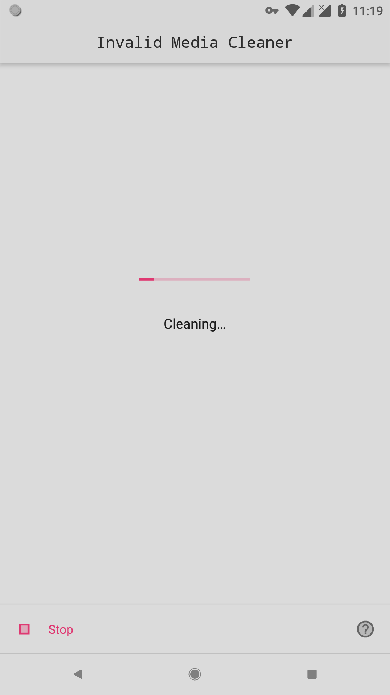

Invalid Media Cleaner
====

Clean invalid media files (Currently support images only) from your Media Store.

## What can it fix?

- Some applications have notified Media Store to scan a wrong location.
- When you use Storage Redirect, the previous event will happen in some apps.
- After uninstalling apps on Android Q DP, the media files in sandbox were removed but they still exist in Media Store.

## How to use it?

1. Install from [GitHub Releases](https://github.com/fython/InvalidMediaCleaner/releases) or compile by yourself.
2. Click "Scan" button and choose actually invalid media files.
3. Click "Clean" button

## Screenshots

## Licenses

Apache License 2.0 